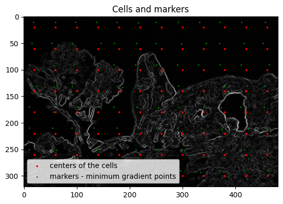

# Waterpixels Generation

## Note : 
This work was done as a school project for the course "Image Processing " at Télécom Paris **IMA201**. The goal of this project is to generate superpixels using the watershed algorithm. The implementation followed this [paper](https://minesparis-psl.hal.science/hal-01139797/file/2014.icip.machairas.al.waterpixels.pdf) you will find the implementation in the jupyter notebook the streamlit web app in `app.py` and the detailed report in 

`[waterpixels_generation_report](./IMA_201_waterpixels_generation_report_Benaziza_v2.pdf)

**N.B.** This implementation is not the most optimal one, feel free to suggest any improvements or modifications.

## Introduction

- **Author**: Chems-eddine benaziza
- **Supervised by**: Christophe Kervazo
- **Affiliation**: Télécom Paris, Institut polytechnique de Paris
- **Original paper**:[ Waterpixels: Superpixels based on the watershed
transformation](https://minesparis-psl.hal.science/hal-01139797/file/2014.icip.machairas.al.waterpixels.pdf)

Superpixels are a crucial preprocessing step in image segmentation techniques. In this presentation, we will focus on a specific type of superpixels called waterpixels, which are generated through the watershed transform.

We will elucidate the implementation pipeline for generating waterpixels, inspired by prior work in this area. The presentation will comprehensively detail the entire implementation process, from the computation of the gradient of an image to the application of the watershed transformation.

## Presentation Outline

1. Definition & Properties of Superpixels
2. Steps to Generate Waterpixels
   1. Computation of the Gradient of an Image: A Morphological Gradient
   2. Definition of Regular Cells on the Image
   3. Selection of One Marker per Cell
   4. Spatial Regularization of the Gradient with the Help of a Distance Function
   5. Application of the Watershed Transformation
3. Demo
4. Conclusion

## Definition of Superpixels

Superpixels are groups of pixels that are similar in color and/or texture, and are typically used as a preprocessing step for image segmentation and object recognition tasks. They provide a way to reduce the complexity of an image by grouping together pixels that belong to the same object or region.

## Properties of Superpixels

- Superpixels are regions in an image that are perceptually meaningful and homogeneous.
- They are used as a preprocessing step for various computer vision tasks such as segmentation, object recognition, and image compression.
- The two main properties of superpixels are:
  1. Boundary Adherence: Superpixels should adhere well to object boundaries in the image. This property ensures that objects are not split across multiple superpixels.
  2. Regularity: Superpixels should have a regular shape and size. This property ensures that the superpixels are easy to work with and can be used as a consistent unit for further processing.

## Steps to Generate Waterpixels

1. Computation of the gradient of an image: a morphological gradient
2. Definition of regular cells on the image centered on the vertices of a regular grid; we choose cell centers in the grid
3. Selection of one marker per cell
4. Spatial regularization of the gradient with the help of a distance function
5. Application of the watershed transformation on the regularized gradient defined in step 4 from the markers defined in step 2

## Computation of the Gradient of an Image: A Morphological Gradient

- Smoothing of the image using morphological opening and closing
- Conversion of the picture from three-channel color to one-gray level channel
- Calculation of the morphological gradient through erosion subtracted from dilation of the image

## Definition of Regular Cells on the Image

- Each cell corresponds to the generation of a unique water pixel
- The choice of one marker per cell offers total control over the number of SP
- The center of cells or the minimal points of the gradient can be used as markers

## Selection of One Marker per Cell

- The selection of markers has enforced the pertinence of future superpixel-boundaries but also the regularity of their pattern
- The importance of marker selection and its impact on the resulting superpixels is discussed

## Spatial Regularization of the Gradient with the Help of a Distance Function

- A technique to regulate the gradient in a spatially coherent manner, balancing between boundary adherence and regularity
- The image gradient is taken as input and a regularized gradient is produced
- A function that calculates the distance between points in the image domain and a set of markers is implemented

## Application of the Watershed Transformation

- The watershed transformation is applied on the regularized gradient defined in step 4 from the markers defined in step 2
- An image partition is obtained, where each region corresponds to a water pixel

## Demo

A quick demonstration of the implemented steps on the jupyter notebook and the web app.

## Conclusion

### Summary of Our Study

In this study, we presented an efficient algorithm for generating waterpixels, a type of superpixel that follows the boundaries of objects in an image. Our algorithm uses a combination of morphological operations and the watershed transform to generate high-quality waterpixels in a fast and efficient manner.

### Key Findings

- Our algorithm is able to generate waterpixels that closely follow the boundaries of objects in an image, resulting in high-quality superpixels.
- Additionally, we have developed a web app that allows users to easily test our method with different parameters, making the process of generating waterpixels even faster and more convenient.

## References

- [waterpixels]
